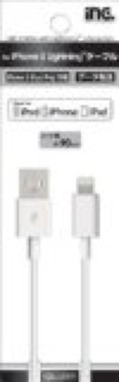
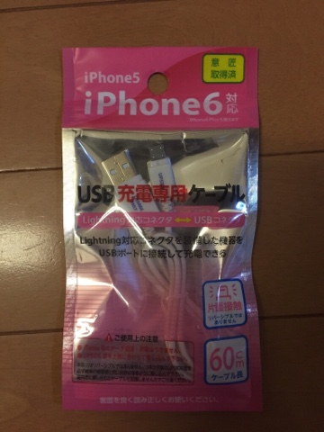
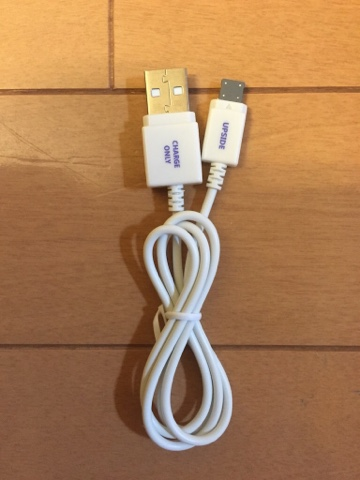
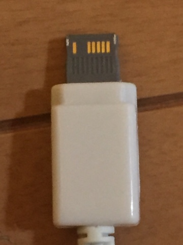
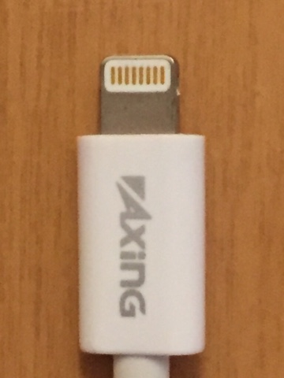

ついこの前、Apple純正ケーブルが壊れてしまいました。

コネクタがポッキリ折れてしまいました。

なので、コンビニで売ってた多摩電子工業のMFi認証Lightningケーブルを買いました。

その後、ダイソーでこんなものを見つけました。

100円のLightningケーブルです。なんかニセモノって感じです。比べてみると一目瞭然です！

皆さんが使う場合は、自己責任でお願いします。
