手打ち生パスタを作った。

## 材料

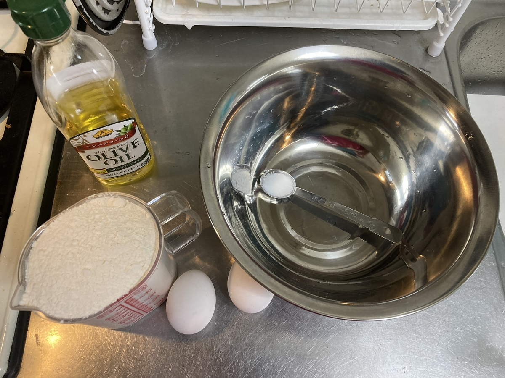

- 強力粉 300g
- 卵 1個
- オリーブオイル 大さじ1
- 塩 小さじ1/2

## 作り方

1. ボウルに粉と塩をぶちまける
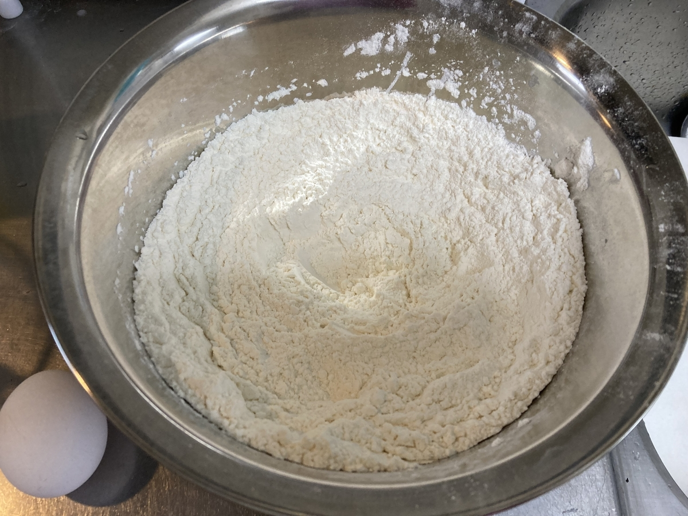
2. 卵と水とオリーブオイルを計量カップに入れたら、水を足して合計150mlくらいになるようにする
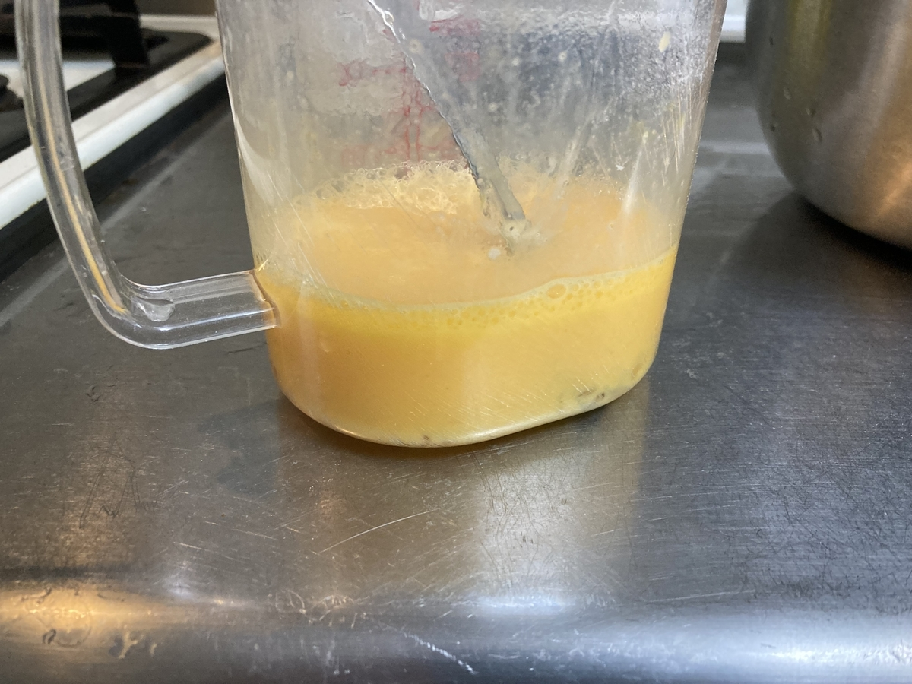
3. 2 を 1 に少しずつ加えながら混ぜる(水回し)
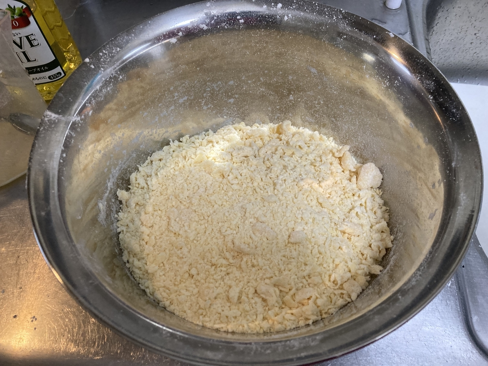
4. こねてまとめる
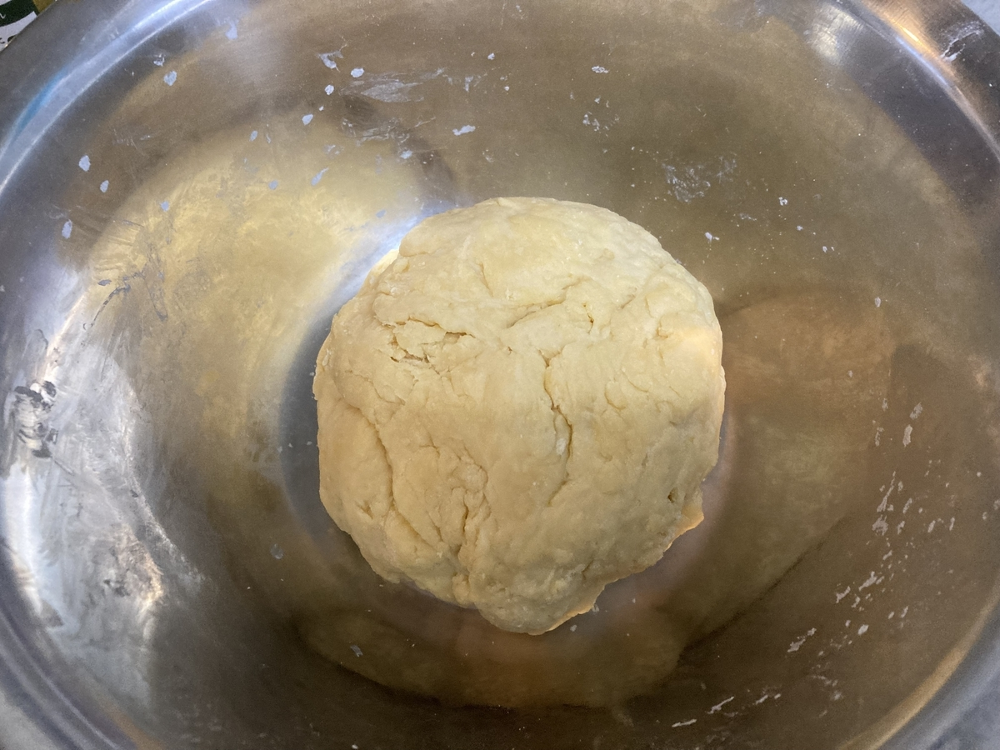
5. ラップでくるんでしばらく寝かせる
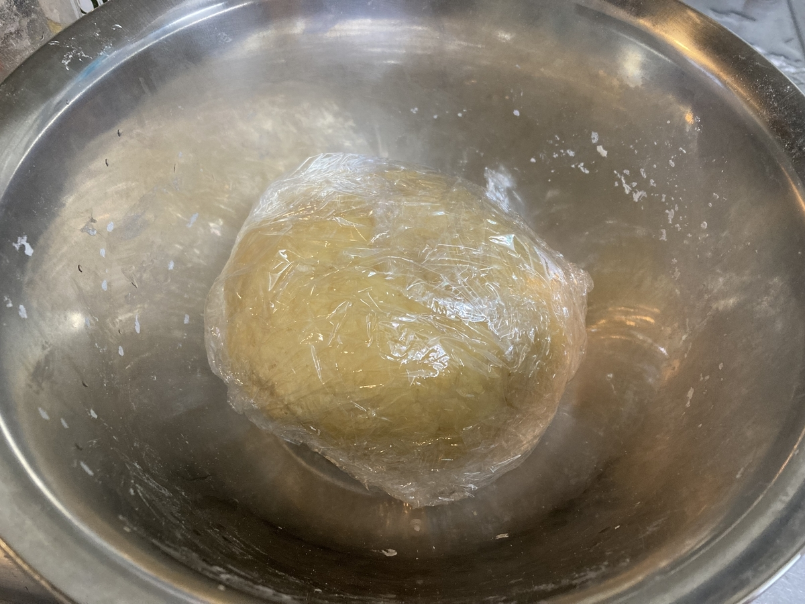
6. のばす
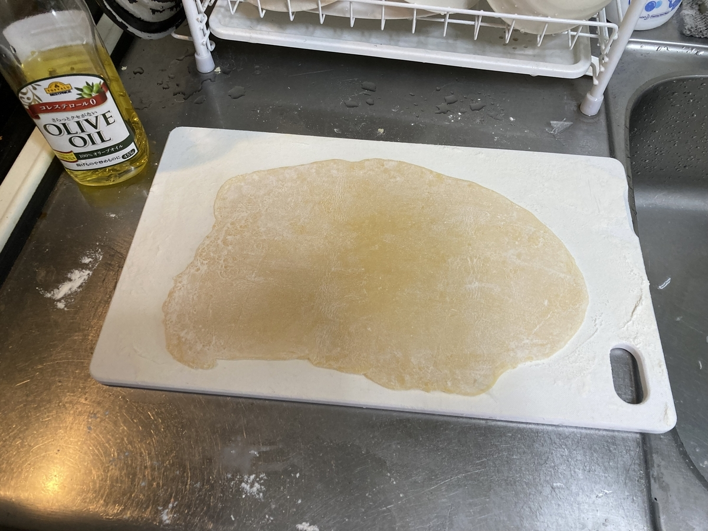
7. 三つ折りにする
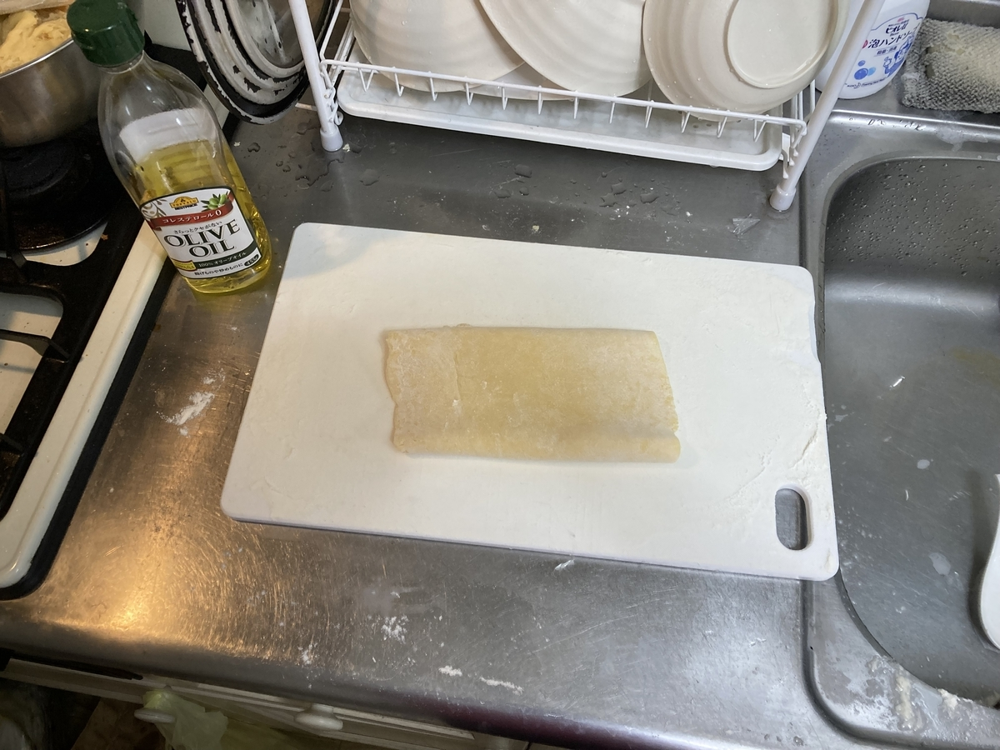
8. 適当に切る
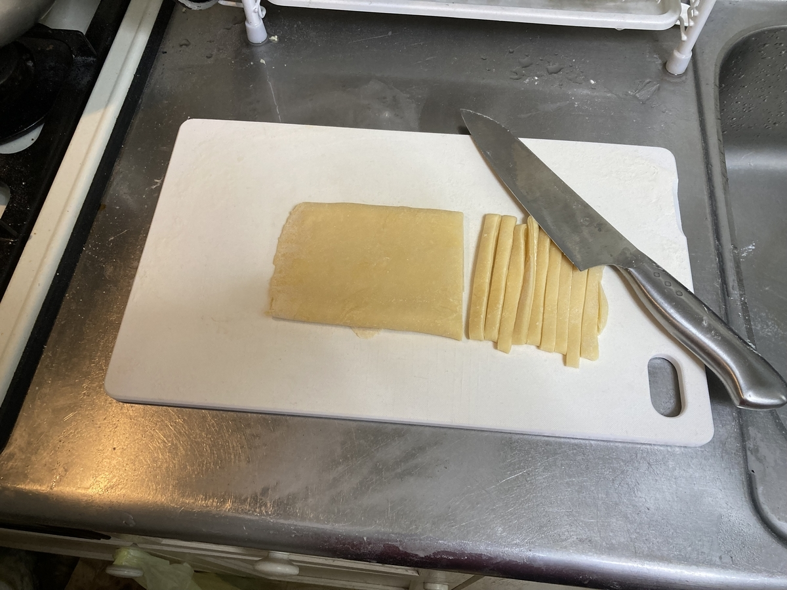
9. 打ち粉をして袋にでも入れておく
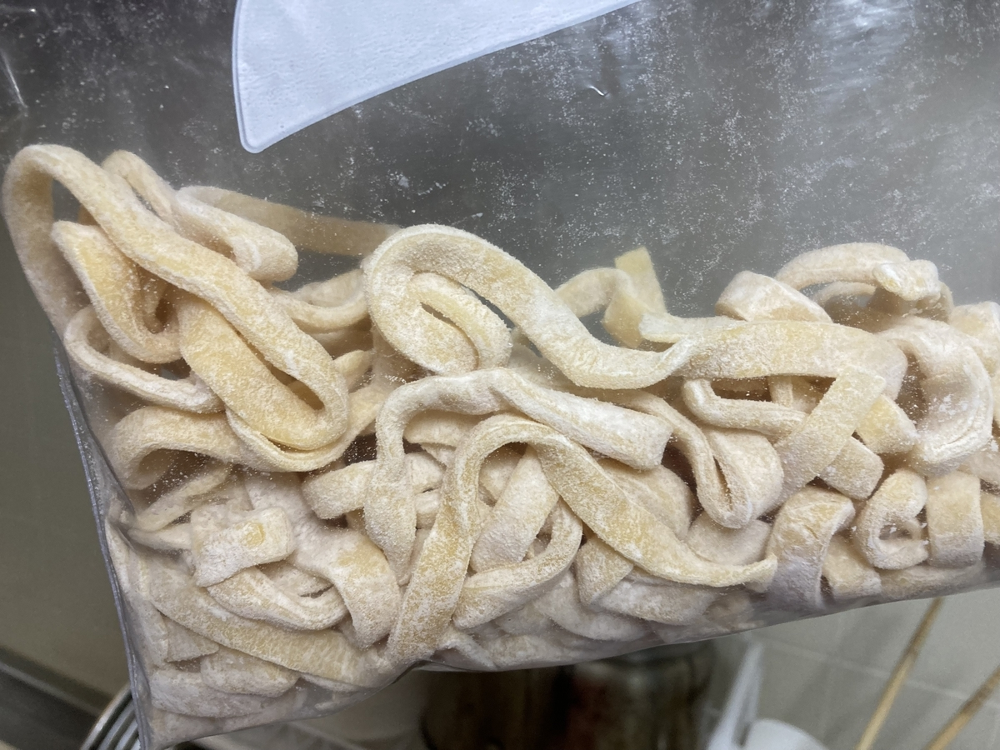
10. おしまい

## 食べる

適当にカルボナーラを作って食べた(ブラックペッパーがなかった・盛り付け失敗したのでちょっと見た目が残念)。

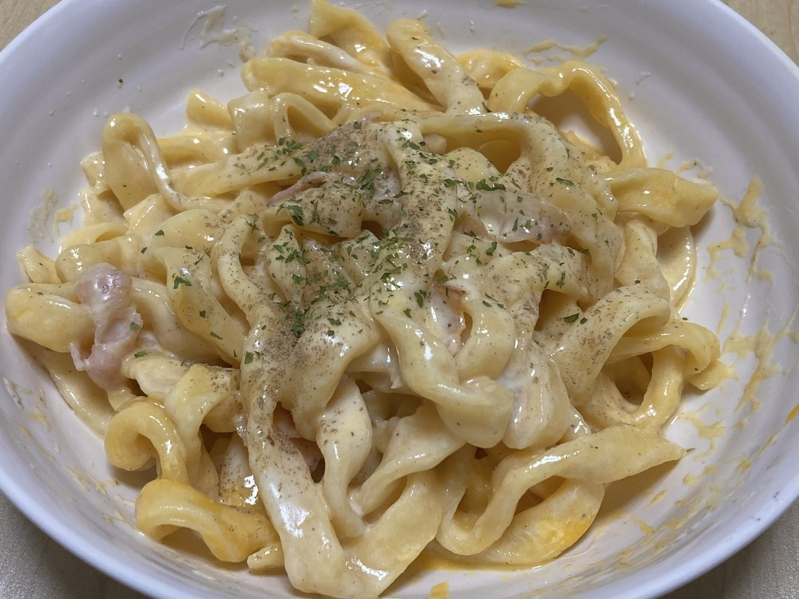

## おわりに

おいしかった。
