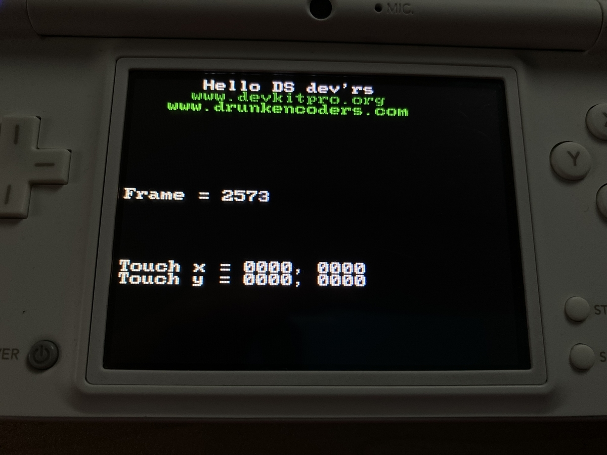
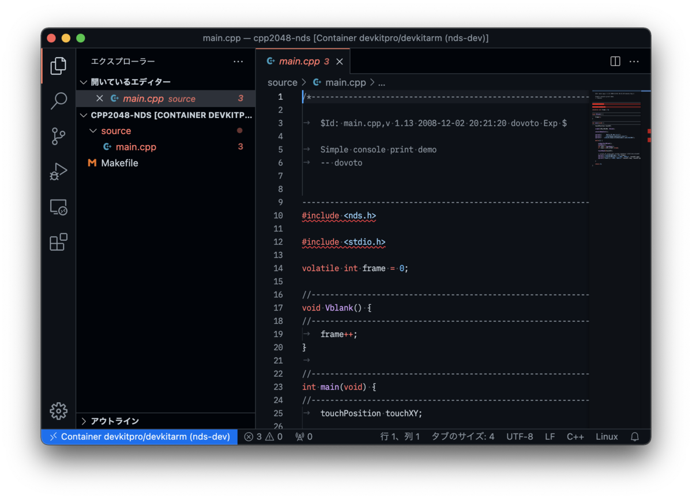
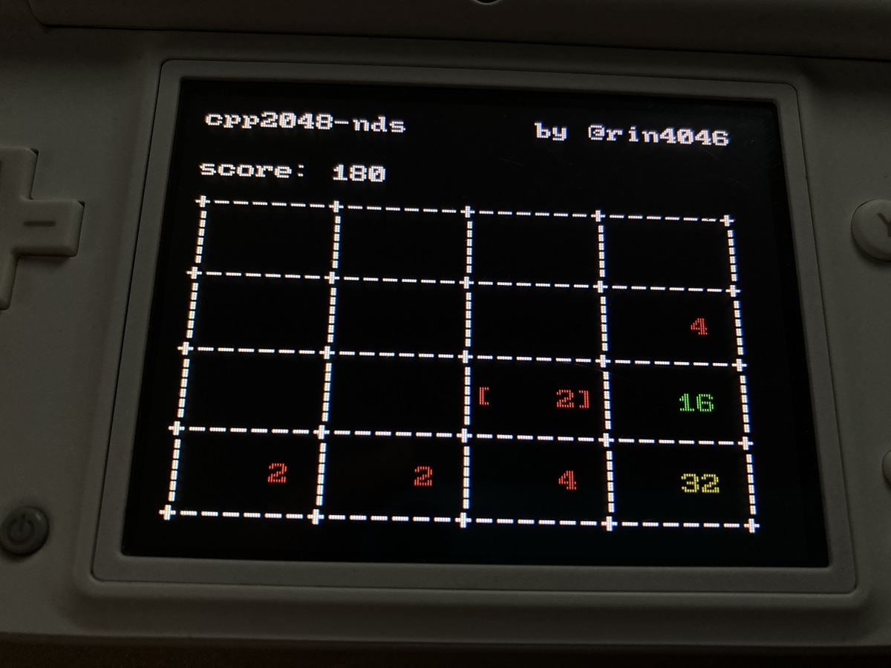

これは、[TUT Advent Calendar 2021](https://adventar.org/calendars/6364) 8日目の記事です。

はじめまして、今年の春に豊橋技術科学大学に入学した、B1の[@rin4046](https://twitter.com/rin4046)です。よろしくお願いしますm(\_ \_)m

とにかく何か変わったことを記事にしたいと思ったので、最近試した「Nintendo DS(以降NDSと表記)上で自作のプログラム(=Homebrew)を動作させる」ことについて書いてみました。

<!-- more -->

### ダイパリメイク、流行ってますね

そもそもこんなことをしようと思ったきっかけはポケモンBDSP発売にあります。

私はNintendo Switchを持っていなかったので話題にのっかれず、一人でちまちまと「ポケットモンスタープラチナ」をプレイしていました。私にとってDSiは生まれて初めて買ってもらったゲーム機であり、ポケットモンスタープラチナもまた、生まれて初めて遊んだゲームだったので、非常に思い入れがありました。

そんなDSiでゲームをしているある日、「こいつ、SDカードからHomebrew起動できるようになったんじゃなかったっけ…？」このことを思い出した瞬間、エムリットとクレセリアの捕獲そっちのけでNDS向けHomebrew開発について調べ始めました。

こうしてこんな意味のわからんタイトルの記事が出来上がりました。

### NDS上でHomebrewを実行する手段

自作のNDS用プログラムを実行する手段はいくつかあります。

1. PC 上で NDS エミュレータを用いて実行する
2. マジコンを用いて実機で実行する(マジコン輸入のハードル高い、バレたら税関で没収される)
3. Nintendo DSi(以降DSiと表記)にて発見された脆弱性を用いて実行する
4. カスタムファームウェア導入済みNintendo 3DSのDSモードで実行する

などなど。

現在手元にDSiがあり、そして何よりも実機でHomebrewを動作させることによる達成感を味わいたかったので、DSi実機の上で実行する方法を選択しました。

### DSiの脆弱性について

2018年ごろ、No$gba(GBA・NDSエミュレータ)開発者のno$cash氏によって「Unlaunch」というDSi用のbootcode exploitが公開されました。この脆弱性はDSiに用意されている公式のランチャー(いわゆるホーム画面)が起動する前に、`SCFG_EXT`というレジスタへのアクセス権を取得することで任意のコードが実行できる様になるというものです(この辺りの仕組みあまりよくわかっていません)。

詳しい内容と導入方法は以下のサイトに丁寧にまとめられています。

[https://dsi.cfw.guide/](https://dsi.cfw.guide/)

### devkitPro・devkitARMについて

devkitProとは、ArmやPowerPC、MIPSといったアーキテクチャを採用するゲームコンソール上で動くプログラムを開発する為のツール一式を提供しているプロジェクトです。devkitProが提供しているツール群の一つにdevkitARMというものがあり、これを用いることでNDS向けプログラムのビルドを容易に行うことができます。

devkitARMは、コンパイラ・リンカ等に「GNU Arm Embedded Toolchain」を採用しています。しかもGCCツールチェインのバージョンが11なので「10年以上前のゲーム機であるNDS上でC++20相当のコードを動かす」なんていう意味のわからないことができます。

また、GCCの他に`libnds`というCで実装されたNDS用ライブラリが付属します。任天堂の権利を侵害せずに書かれたオープンソース(zlib License?)のライブラリで、これを用いることでHomebrewの開発が容易になります。

とてもありがたいことに、devkitARMには公式のDocker Imageが存在するので、まずはそれを使ってサンプルプログラムをビルドしてみます。

### とりあえずサンプルプログラムを

以下のコマンドで`nds-dev`コンテナを作成&アタッチし、作業用ディレクトリを作成します。

```sh
$ docker run -it --name nds-dev devkitpro/devkitarm
$ mkdir workdir && cd workdir
```

devkitProプロジェクトが`libnds`を用いたサンプルコードを公開しているので、cloneします。

```sh
$ git clone https://github.com/devkitPro/nds-examples
$ cd nds-examples/hello_world
$ make
```

`hello_world`ディレクトリ内で`make`すると`hello_world.nds`という、NDS用の実行ファイルが生成されます。これを実機で実行してみると次の様な画面が表示されます。



無事にNDSでサンプルプログラムを動作させることが出来ました。

### hello_world を読む

先ほどビルドした`hello_world`内の`main.cpp`からコメントを取り除いたソースが以下になります。ここから重要そうな関数を掻い摘んで読んでみます。

```cpp
#include <nds.h>
#include <stdio.h>

volatile int frame = 0;

void Vblank() {
	frame++;
}
	
int main(void) {
	touchPosition touchXY;

	irqSet(IRQ_VBLANK, Vblank);

	consoleDemoInit();

	iprintf("      Hello DS dev'rs\n");
	iprintf("     \x1b[32mwww.devkitpro.org\n");
	iprintf("   \x1b[32;1mwww.drunkencoders.com\x1b[39m");
 
	while(1) {
		swiWaitForVBlank();
		scanKeys();
		int keys = keysDown();
		if (keys & KEY_START) break;

		touchRead(&touchXY);

		iprintf("\x1b[10;0HFrame = %d",frame);
		iprintf("\x1b[16;0HTouch x = %04X, %04X\n", touchXY.rawx, touchXY.px);
		iprintf("Touch y = %04X, %04X\n", touchXY.rawy, touchXY.py);
	}

	return 0;
}
```

#### irqSet関数
画面切り替え時(VBlank)の割込ハンドラを登録しています(ちなみにVBlankという名称はブラウン管時代の名残だったりします)。

#### consoleDemoInit関数
画面の初期化やフォントの読み込みなど諸々をまとめてやってくれる、デモプログラムを作成するときにめちゃくちゃ便利な関数です。

#### iprintf関数
printfと同じような感覚で画面に文字を出力することができる関数です。一部のエスケープシーケンスも使えるため、ちょっとカラフルにしたりも出来ます。この関数だけなぜかヘッダ内にプロトタイプ宣言がなく、libnds公式ドキュメントにも記載が見当たりませんでした。

#### swiWaitForVBlank関数
VBlank割込を待つ関数であり、while文の中身は画面切り替え周期にあわせて実行されます。

#### scanKeys、keysDown関数
キー入力を受け取る為の関数です。

これらの関数があればちょっとしたゲームを作ることができそうです。

### 簡単なゲームを作ってみる

#### ゲームのネタ・作業用ディレクトリの準備
3年前に、[2048](https://play2048.co/)というゲームをAdobe Flashに(なんとな〜く)移植したのですが、そのときのコードをたまたま発掘したので今回はそれをNDS向けに実装してみました。まずは`hello_world`ディレクトリを`workdir`の下に複製します。

```sh
$ cp -r ../hello_world ../../cpp2048-nds
```

「できるだけモダンな開発環境を」が今回の記事のテーマでもあるので、VS Codeに`Remote - Containers`拡張機能を導入し、VS Codeから起動中のDocker Containerにアタッチしました。その後、先ほど作成した`cpp2048-nds`を開きます。VS Codeでの開発に不要なファイルを削除するとこんな感じになります。



ソースツリーとMakefileだけという、非常にシンプルな構成です。

#### IntelliSenseの構成

このままだと、VS CodeのIntelliSenseが`libnds`のインクルードパスを解決できないので、`c_cpp_properties.json`を追加します。

```json
{
  "configurations": [
    {
      "name": "devkitARM",
      "includePath": [
        "${workspaceFolder}/**",
        "/opt/devkitpro/libnds/include"
      ],
      "forcedInclude": [
        "${workspaceFolder}/.vscode/iprintf.h"
      ],
      "defines": [
        "ARM9"
      ],
      "cStandard": "c17",
      "cppStandard": "c++20",
      "compilerPath": "/opt/devkitpro/devkitARM/bin/arm-none-eabi-gcc"
    }
  ],
  "version": 4
}
```

また、先ほども述べた様に、`iprintf`関数のプロトタイプ宣言が存在しないが故にIntelliSenseがエラーを吐くので、以下の様な`iprintf.h`を作成し、`c_cpp_properties.json`内の`forcedInclude`で定義を読み込ませました。

```c
#ifdef __GNUC__
#define _ATTRIBUTE(attrs) __attribute__(attrs)
#else
#define _ATTRIBUTE(attrs)
#endif

int iprintf(const char *__restrict, ...)
    _ATTRIBUTE((__format__(__printf__, 1, 2)));
```

これでIntelliSenseの構成が完了しました。ここまで来れば、あとは`source`以下にプログラムを書いていくだけです。私の書いたサンプルプログラムは以下のリポジトリにて公開しています。

[https://github.com/rin4046/cpp2048-nds](https://github.com/rin4046/cpp2048-nds)

私はあえて、C++17 構造化束縛やC++11 randomヘッダを使って実装しました(その方がネタになると思ったので)。もちろん何の問題もなくmake、実行できました。



### まとめと感想

Makefileが行なっているビルドプロセスをじっくりとみてみたり、直接レジスタに値を代入して画面表示を変更してみたりなど、新たな知識をいろいろ得ることができて楽しかったです。

それと同時に、しっかりと構成したブログ記事を書くのがめちゃくちゃ苦手であることを再認識させられました…

今後もしょーもないものから真面目なものまでいろいろ作って知見を広めていきたいなぁと思ってます。
