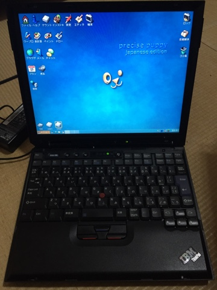

PuppyLinuxをインストールしました。
インストールパソコンはIBMのThinkPad X32(メモリ増設してない)です。かなりお気に入りのパソコンです。

インストールはものすごく簡単でした。他の人の役に立つように、インストール方法をここに書いておきます。

1、PuppyLinuxのダウンロード

オープンラボラトリさんのPuppyLinuxダウンロードサイトから、自分のパソコンに合ったisoをダウンロードします。

2、インストールディスクの準備

UNetBootinという、Win・Mac・Linux対応のLinuxの起動可能なUSBメモリを作るフリーソフトでさっきダウンロードしたisoを書き込みます。この作業はインストールするパソコンでなくても大丈夫です。

3、インストールするパソコンにUSBをして起動

書き込みが終わったら、インストールするパソコンのBIOSの起動の優先順位とかを調節して(BIOSについては自分で調べてみてください)USBから起動し、「Default」の所でEnterを押すとPuppyLinuxが起動します。

4、パーティションの調整

(パーティションって何？っていう人は調べてからこの先を読んでみてください)パーティションの管理はPuppyLinuxに入っているGPartedで管理します。

まずハードディスクの中のパーティションをすべて消してフォーマットします。次に、下のように設定します。

sda1は100MBで、ext4でフォーマットしてbootフラグをつけます。

sda2は[ハードディスクの全体の容量ー100MBー1024MB]の容量にして、ext4でフォーマットします。

sda3は1024MBで、linux-swapでフォーマットします。

5、PuppyLinuxのインストール

(もしUSBがマウントされていなかったらデスクトップのUSBのアイコンをクリックして開いてマウントされたら閉じてください)インストールのアイコンからユニバーサルインストーラを起動して、FULLインストールします。インストール先にはsda2を指定します。あとは画面の指示に従ってください。

6、GRUB4DOSのインストール

ブートローダーをインストールします。FRUGALとWindowsにかいてあるものを消して、FULLだけにしてGRUB4DOSをインストールします。

7、インストール完了

メニューからシャットダウンします。保存はしないで、インストールディスクを取り出すチェックも外してください。電源が切れたら、USBメモリを抜いてインストール完了です。

雑な説明でごめんなさい。あと、これからは、図を増やすのも努力します。
