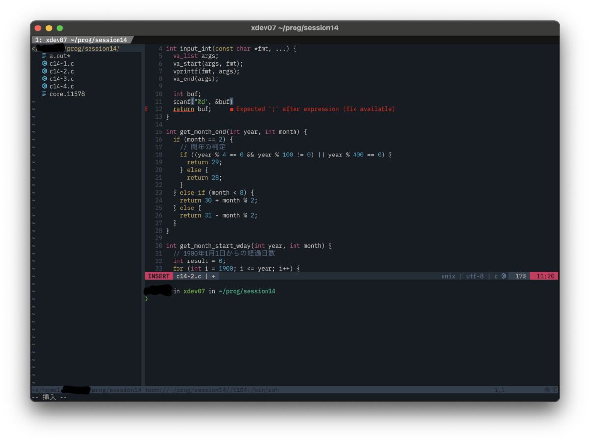

メモ・駄文なので悪しからず。

<!-- more -->



最終的にこんな感じにします。

### GNU Toolchain のバージョンを上げる

弊学のLinuxサーバーではGCC 4.8.5がデフォルトとなっています。

このバージョンだと色々と不便することがあって、例えば -std=c99 しないとfor文のカッコ内で変数の初期化ができなかったりします。

幸いにも、[https://hpcportal.imc.tut.ac.jp/wiki/ClusterSystemSpec](https://hpcportal.imc.tut.ac.jp/wiki/ClusterSystemSpec) を見たところ、Red Hat Developer Toolset によって管理されたGCC 7.3.1が入っているようなので今回はこれを使います(GCC11の自前ビルドもしてみましたが、生成物の大きさが1GB超だったこと・GCC7くらいならまだ許容範囲ということで今回は使わないことにしました)。

```zsh
if [[ "$(hostname)" =~ "^xdev.*" ]]; then
  source /opt/rh/devtoolset-7/enable
fi
```

こんなシェルスクリプトを .zshenv とかに追記してやればちょうどいいんじゃないかと思います。

source ~/.zshenv した後で gcc --version するとちゃんとバージョンが上がっていることが確認できます。

### NeoVim の導入・カスタマイズ

[https://github.com/neovim/neovim/releases](https://github.com/neovim/neovim/releases)

上記から nvim.appimage をダウンロードして nvim にリネーム後、パスの通ってるディレクトリに配置してやるだけでインストールは終了です。

私が現在使用している init.vim の構成は以下を参照してください。

[https://github.com/rin4046/dotfiles/blob/master/.config/nvim/init.vim](https://github.com/rin4046/dotfiles/blob/master/.config/nvim/init.vim)

### Clangd の導入

折角 NeoVim を導入したので、LSP も使いたいところです。弊学のサーバーには Clang は入っていますが、Language Server である Clangd は入っていないので導入していきます。

GitHub にある公式リポジトリからバイナリをダウンロードしてみましたが、glibc のバージョンが古いことにより実行できないようです。Linux あるあるですね。こういったときは大抵、使いたいソフトウェアを自前でビルドしてしまうのが一番手軽です。

```zsh
#!/bin/zsh

cd && mkdir workdir && cd workdir

# CMake
curl -OL "https://github.com/Kitware/CMake/releases/download/v3.22.0/cmake-3.22.0-linux-x86_64.tar.gz"
tar xvf cmake-3.22.0-linux-x86_64.tar.gz
export PATH="$HOME/workdir/cmake-3.22.0-linux-x86_64/bin:$PATH"

# Clangd
curl -OL "https://github.com/llvm/llvm-project/releases/download/llvmorg-13.0.0/llvm-project-13.0.0.src.tar.xz"
tar xvf llvm-project-13.0.0.src.tar.xz
cd llvm-project-13.0.0.src
mkdir build && cd build

cmake -DCMAKE_INSTALL_PREFIX=$HOME/.local/clangd-13.0.0 \
      -DCMAKE_BUILD_TYPE=Release \
      -DLLVM_ENABLE_PROJECTS="clang;clang-tools-extra" \
      ../llvm
cmake --build . --target clangd -- -j4
cmake --install . --component clangd
cmake --install . --component clang-resource-headers

cd && rm -rf workdir
```

こんなシェルスクリプトを書いて実行してやれば、Clangd の動作に必要なファイルだけをインストールできます。GitHubのReleaseで配布されていたものと比較しても、ディレクトリ構造や含まれるファイルに(おそらく)差はありませんでした。

### おわりに

TUT のプログラミング演習の講義がこれでとても快適に受けられるようになると思います。

<s>(言い忘れてましたが、Clangd のビルド、1時間半ぐらいかかります)</s>
