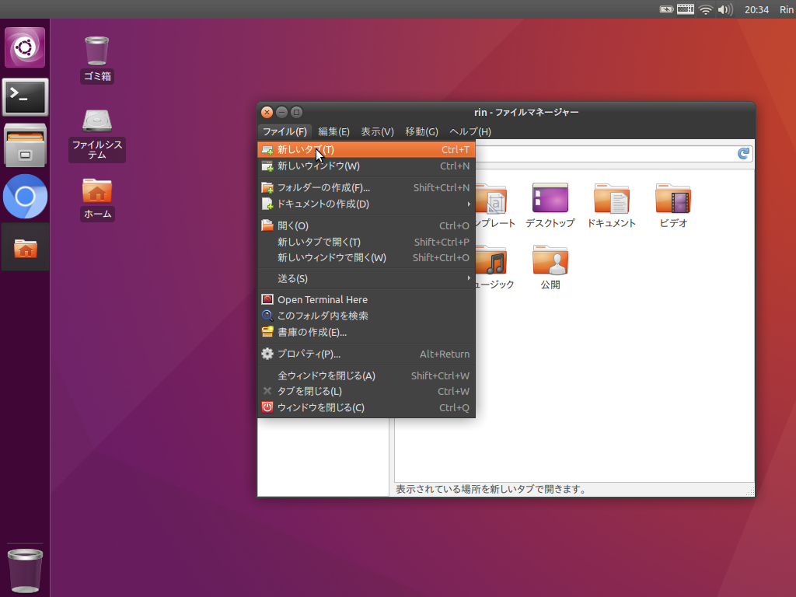
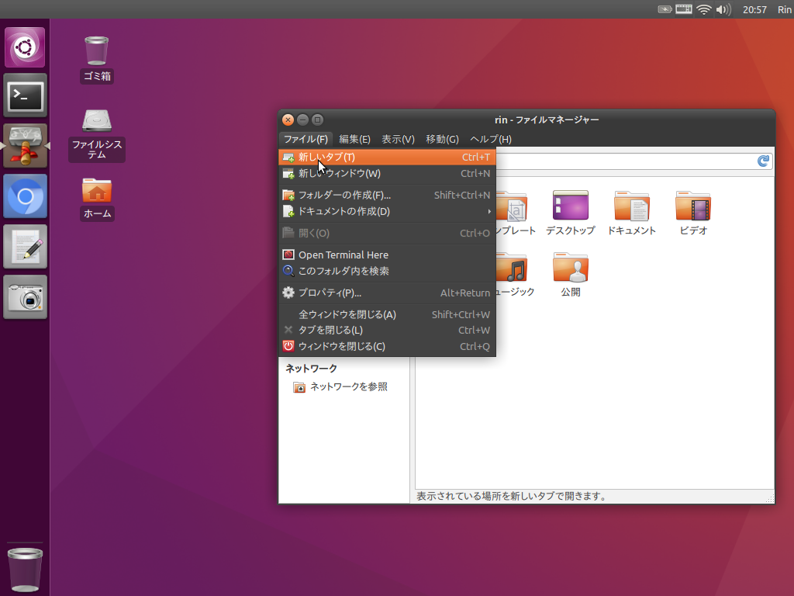

ThinkPad X32のOSをLubuntu 16.04 LTSからXubuntu 16.04 LTSに変えたついでに、XubuntuをUbuntuっぽくしてみました(前回もそんな感じだった気が)。

前回とは違い、DockyとかPlankみたいなドック系のアプリケーションを追加せずに、Xfceのパネルを使ってドックを作ってみました。

OS自体はやや重くなりましたが、安定していると思います。



### 追記(2017年1月12日)

後から、DockbarXという、Xfceのパネルに組み込んで使うこともできるアプリケーションを見つけたので、それを使ってみました。こっちのほうがよりUbuntuのドックに近くなると思います。



一応、インストールした時のメモをしておく。

```
sudo add-apt-repository ppa:dockbar-main/ppa
sudo apt update
sudo apt install dockbarx xfce4-dockbarx-plugin dockbarx-themes-extra
```

インストールが終わったら、普通のパネルのアイテムと同じように追加して、「DockbarX Preference」からドックのテーマを「E-Unity round」にすると、ちょうど良くなります。
